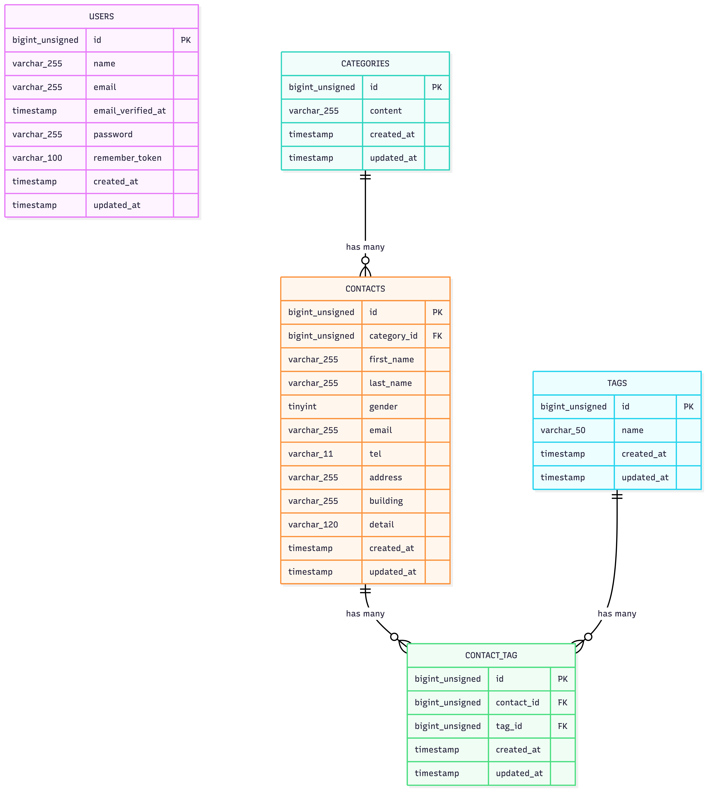

# COACHTECH お問い合わせフォーム

## 概要

本プロジェクトは、COACHTECHの確認テストとして作成したお問い合わせフォームアプリケーションです。

ユーザーはお問い合わせフォームから問い合わせ内容を送信でき、管理者は管理画面でお問い合わせ内容の検索・詳細確認・削除・CSVエクスポート・タグ管理を行うことができます。

また、公開APIとしてお問い合わせの一覧取得・詳細取得・作成・更新・削除機能を実装しています。

## 主な機能

- お問い合わせフォーム入力
- お問い合わせ内容確認
- お問い合わせ送信
- サンクスページ表示
- 管理者ログイン
- 管理画面でのお問い合わせ一覧表示
- キーワード・性別・カテゴリ・日付による検索
- ページネーション
- お問い合わせ詳細表示
- お問い合わせ削除
- CSVエクスポート
- タグ作成・編集・削除
- APIによるお問い合わせCRUD機能

## ER図

## 環境構築手順

### リポジトリをクローン

git clone https://github.com/taisei1208/contact-form-app
cd contact-form-app

### Laravel Sailをインストール

docker run --rm \
 -u "$(id -u):$(id -g)" \
 -v "$(pwd):/var/www/html" \
 -w /var/www/html \
 -e COMPOSER_CACHE_DIR=/tmp/composer_cache \
 laravelsail/php82-composer:latest \
 composer require laravel/sail --dev

### Sailの設定ファイルをパブリッシュ（MySQLを選択）

docker run --rm \
 -u "$(id -u):$(id -g)" \
 -v "$(pwd):/var/www/html" \
 -w /var/www/html \
 -e COMPOSER_CACHE_DIR=/tmp/composer_cache \
 laravelsail/php82-composer:latest \
 php artisan sail:install --with=mysql

### .env ファイルを開き、データベース接続情報が以下と一致していることを確認します。

DB_CONNECTION=mysql
DB_HOST=mysql
DB_PORT=3306
DB_DATABASE=laravel
DB_USERNAME=sail
DB_PASSWORD=password

### NPM依存パッケージのインストール

> 重要: sail npm install を実行する前に、必ずSailコンテナが起動していることを確認してください。

sail npm install

### Vite開発サーバーの起動

sail npm run dev

### Sailをバックグラウンドで起動

./vendor/bin/sail up -d

### エイリアスを設定して 'sail' だけでコマンドを実行できるようにする

echo "alias sail='[ -f sail ] && bash sail || bash vendor/bin/sail'" >> ~/.zshrc

### シェルを再起動するか、新しいターミナルを開いてエイリアスを有効にする

exec $SHELL

### アプリケーションキーを作成

sail artisan key:generate

### マイグレーションとシーディングを実行

sail artisan migrate:fresh --seed

## 使用技術

| 技術    | バージョン |
| ------- | ---------- |
| PHP     | 8.2        |
| Laravel | 10         |
| MySQL   | 8.0        |

## APIエンドポイント一覧

| メソッド | パス                         | 概要                 |
| -------- | ---------------------------- | -------------------- |
| GET      | `/api/v1/contacts`           | お問い合わせ一覧取得 |
| GET      | `/api/v1/contacts/{contact}` | お問い合わせ詳細取得 |
| POST     | `/api/v1/contacts`           | お問い合わせ新規作成 |
| PUT      | `/api/v1/contacts/{contact}` | お問い合わせ更新     |
| DELETE   | `/api/v1/contacts/{contact}` | お問い合わせ削除     |

## 開発環境URL

| 項目                 | URL                              |
| -------------------- | -------------------------------- |
| お問い合わせフォーム | http://localhost                 |
| 管理画面             | http://localhost/admin           |
| ログイン画面         | http://localhost/login           |
| API                  | http://localhost/api/v1/contacts |

## 作成者

takeda taisei
